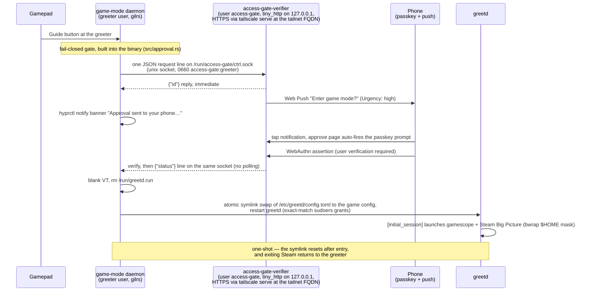

# Game Mode Service

A greetd-integrated couch gaming setup: press the Guide button on a gamepad at
the login greeter, approve the request with a passkey on your phone, and the
machine boots straight into Steam Big Picture inside gamescope. Exiting Steam
("Switch to Desktop") lands back on the greeter.

## Overview

Three cooperating pieces:

1. **game-mode daemon** (Rust, `src/`) — runs as the `greeter` user alongside
   greetd, listens for the gamepad Guide button while the greeter is on screen.
2. **Approval verifier** (Rust, `verifier/`) — a WebAuthn relying party +
   Web Push sender. Entering game mode requires a passkey approval from your
   phone; the approval is one notification tap + one biometric.
3. **greetd config switching** — the daemon symlinks
   `/etc/greetd/config.toml` between the greeter config and an autologin
   config that launches gamescope + Steam, then restarts greetd.

## Approval flow



Test the gate without a gamepad: `sudo -u greeter game-mode --test-approval`

Security model:

- **Trust is the single enrolled passkey** (phone secure element + biometric).
  The push notification carries no authority — anyone who sees it can only
  open the approve page, which requires the passkey assertion.
- The verifier's control plane is a unix socket owned `access-gate:greeter`
  mode 0660 — only the daemon can create requests (a localhost TCP port
  would be reachable by any local process). The tailnet-exposed web plane
  can answer requests but never create or read them.
- The WebAuthn origin is the machine's **Tailscale FQDN** served over HTTPS
  via `tailscale serve` (WebAuthn requires a real TLS origin; MagicDNS
  domains are on the Public Suffix List, so the FQDN is a valid RP ID).
- Deny, timeout, verifier down, daemon errors: all stay at the greeter
  (fail-closed). Every outcome shows a banner on the greeter via
  `hyprctl notify`.

Components on disk after install:

| Path | What |
|---|---|
| `/usr/bin/game-mode` | daemon binary (incl. the approval client, greeter banners, and the `setup` subcommand) |
| `/usr/bin/game-mode-wrapper` | game session entrypoint (bwrap home mask → Steam Big Picture) |
| `/usr/bin/steamos-session-select` | Steam "Switch to Desktop" hook (logs to `/tmp/steamos-session-select.log`) |
| `/usr/bin/access-gate-verifier` | verifier (Rust: webauthn-rs + web-push, `verifier/`) |
| `/usr/share/game-mode/greetd/` | greetd config templates, rendered into `/etc/greetd` by `game-mode setup` |
| `/etc/game-mode/config.toml` | runtime config (VT, session user/group, game library dir) — written by `game-mode setup` |
| `/run/access-gate/ctrl.sock` | control socket (created by the verifier at start) |
| `/etc/game-mode/approval.env` | verifier + daemon config (RP ID, socket, timeout) |
| `/var/lib/access-gate/` | enrolled passkey, push subscription, VAPID key (system user `access-gate`) |
| `/etc/greetd/` | greeter + game session configs (rendered/deployed by `game-mode setup`) |
| `/etc/sudoers.d/greeter-greetd` | exact-match grants: restart greetd, fgconsole, rm the greetd runfile |

### One-time phone setup

After `sudo game-mode setup` (only while not already done):

1. **Enroll** — open `https://<tailnet-fqdn>/enroll` on the phone (after
   `sudo -u access-gate touch /var/lib/access-gate/enroll-open`), tap
   "Create passkey", save it in your phone's passkey provider (Google
   Password Manager, Bitwarden, …). Gated by the `enroll-open` flag file and
   only possible while no key is enrolled.
2. **Notifications** — open `https://<tailnet-fqdn>/setup`, tap "Enable
   notifications". Registers a Web Push subscription (sent with high urgency
   so a locked/dozing phone still buzzes). No extra app needed — the pushes
   go through the browser.

To redo either later:

```bash
sudo -u access-gate touch /var/lib/access-gate/enroll-open   # + delete credential.json first if re-enrolling
sudo -u access-gate touch /var/lib/access-gate/push-open
```

then open `https://<tailnet-fqdn>/enroll` or `/setup` on the phone.

Note: with Bitwarden as the provider you may get two biometric prompts
(vault unlock + passkey user verification). Google Password Manager does it
in one, or relax Bitwarden's vault timeout.

## Requirements

- Arch Linux (primary; Fedora best-effort via COPR). `[multilib]` enabled
  (Steam).
- Packages beyond the hard deps (`greetd`, `gamescope`, `cage`):
  `greetd-regreet` (the greeter is cage + regreet; desktop sessions still
  launch Hyprland via the `start-hyprland` watchdog), `steam`, `bubblewrap`,
  `swaybg`, `tailscale`, `discord`, `discover-overlay` (AUR).
- **Tailscale up and logged in** before running setup — the verifier's HTTPS
  origin is the tailnet FQDN.
- A phone on the tailnet with a passkey provider, and a gamepad with a
  Guide/Mode button.
- The game session autologin user, group, VT, and game library directory
  live in `/etc/game-mode/config.toml`, written interactively by
  `sudo game-mode setup` (defaults come from `src/config.rs`).

## Installation

Arch, from the [mason] pacman repo:

```ini
# /etc/pacman.conf
[mason]
SigLevel = Optional TrustAll
Server = https://masonrhodesdev.github.io/arch-repo/x86_64
```

```bash
sudo pacman -Sy game-mode
```

Fedora (best-effort — steam is in RPM Fusion, tailscale in Tailscale's repo):

```bash
sudo dnf copr enable solaris765/game-mode
sudo dnf install game-mode
```

The package installs files only. Provision the host afterwards:

```bash
sudo game-mode setup
```

`game-mode setup` prompts for the game-session user/group/library dir and
writes `/etc/game-mode/config.toml`, creates the games user, sets up
`/etc/greetd` permissions, renders and deploys the greetd configs (the
greeter is cage + regreet — no compositor config to break), installs the
sudoers grant, checks tailscale + writes the approval env, configures
`tailscale serve`, and enables the services. It is idempotent — re-run it
after upgrades or to reconfigure.

Note: it offers to restart greetd at the end; an active desktop session
keeps running, the greeter just respawns on its VT.

## Usage

1. At the greeter, press the **Guide** button.
2. The greeter shows "Approval sent to your phone"; the phone buzzes.
3. Tap the notification → fingerprint → Steam Big Picture starts (HDR
   enabled in gamescope; the greeter forces the display back to SDR
   afterwards).
4. In Big Picture: power menu → **Switch to Desktop** ends the session and
   returns to the greeter (Steam runs with `-steamos3`, which is what makes
   it invoke the `steamos-session-select` hook).

Game mode is one-shot by design: after the game session starts, the config
symlink is reset, so any later greetd restart lands on the greeter.

## Filesystem mask

The game session runs Steam inside a bubblewrap sandbox with a curated view
of `$HOME`: secrets (.ssh, .gnupg, browser profiles, repos, …) are absent,
and `$HOME` is read-only except for explicit game binds. See the bind list
in `greetd/scripts/game-mode-wrapper.sh`; add `--bind` lines if a game needs
more. Escape hatch while debugging: `touch /games/.game-mode-no-mask`.

## Discord Integration

Discord runs **inside** the gamescope session with full controller support:

- **Client**: launch the "Discord" non-Steam shortcut from Big Picture once
  per session — it runs `discord` in the sandbox under Steam's reaper, so
  gamescope presents the window natively and Steam Input's desktop layout
  drives it (right stick/pad = mouse, A = click). Its `~/.config/discord`
  state is bound in, so login carries over from the desktop. Pressing Guide
  and returning to BP leaves it running in the background: voice and the
  overlay stay live until you "Stop" it from BP.
  (Autostarting Discord outside Steam was tried and reverted: windows of
  clients Steam didn't launch lack gamescope's STEAM_GAME tagging and can't
  be presented properly.)
- **In-game voice overlay**: `discover-overlay` (X11 backend under
  gamescope's Xwayland, autostarted by the wrapper with retries; log at
  `/tmp/discover-overlay.log`) renders who's talking over BP and games.
- **Decky Loader** (Big Picture QAM plugins): install once under the game
  user's `~/homebrew` (https://decky.xyz) and enable its
  `plugin_loader.service`.

The "Discord" non-Steam shortcut is written into `shortcuts.vdf` by
`game-mode-steam-shortcut` (Rust, binary-VDF, idempotent, backs the file up;
requires Steam to be closed). One-time, as the games user:

```bash
game-mode-steam-shortcut --name Discord --exe /usr/bin/game-mode-discord
```

discover-overlay needs no
config: its defaults show the voice overlay whenever you're in a channel
(`discover-overlay --configure` on the desktop only to restyle/reposition).

First-use notes:

- The first time the overlay connects, Discord shows an authorization prompt —
  approve it once (works in-session via the controller with the Discord
  shortcut focused, or on the desktop).
- Discord's default mic mode is already **Voice Activity**; only check
  Settings → Voice & Video if you previously set push-to-talk.

## Logging & troubleshooting

| Where | What |
|---|---|
| `/etc/greetd/logs/game-mode.log` | daemon (RUST_LOG=game_mode=debug in the unit) |
| `journalctl -u access-gate-verifier` | verifier: requests, push sends (logs FCM status), WebAuthn verifies |
| `/tmp/steamos-session-select.log` | Switch to Desktop invocations + `steam -shutdown` exit |
| `/tmp/game-mode-watchdog.log` | idle-config decisions + black-screen watchdog recoveries |
| `journalctl -u greetd` | session starts/ends |

**Black-screen prevention** (see [`docs/SUSPEND.md`](docs/SUSPEND.md)):
`-steamos3` gives Steam console-style idle suspend; if system suspend is
masked/inhibited the attempt wedges BP black. `game-mode-steam-config` (run by
the wrapper before Steam) zeroes Steam's idle-suspend exactly when suspend is
unavailable and restores it when it isn't, and `game-mode-watchdog` recovers
CEF GPU-crash black screens in-session (webhelper restart + controller
re-sync) without touching running games.

Known gotchas:

- The greeter is deliberately cage + regreet, not Hyprland: a compositor
  upgrade must never be able to break the login path.
- **Regular login bounces straight back to the greeter** (uwsm-managed
  sessions): if `/usr/share/wayland-sessions/hyprland.desktop` was hidden to
  de-duplicate the greeter's session list, use `NoDisplay=true` — uwsm
  refuses entries marked `Hidden=true`.
- **Guide button does nothing after boot**: greetd only honours
  `[initial_session]` when `/run/greetd.run` is absent; the daemon removes
  it before each entry (sudoers grant). If entries stop working, check that
  grant survives (`sudo -u greeter sudo -n /usr/bin/rm -f /run/greetd.run`).
- **No push arrives with the phone locked**: pushes are sent with
  `Urgency: high`; if they still don't arrive, exempt the browser from
  battery optimization on the phone.

## License

MIT — see [LICENSE](LICENSE).
